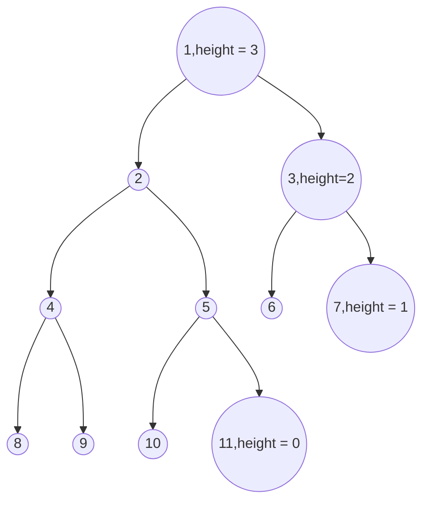

# Ques.

```#
Given an array of size N. The task is to sort the array elements by completing functions heapify() and buildHeap() which are used to implement Heap Sort.
```
`Example 1:`

Input:
N = 5
arr[] = {4,1,3,9,7}
Output:
1 3 4 7 9
Explanation:
After sorting elements
using heap sort, elements will be
in order as 1,3,4,7,9.

`Example 2:`

Input:
N = 10
arr[] = {10,9,8,7,6,5,4,3,2,1}
Output:
1 2 3 4 5 6 7 8 9 10

`Explanation:`
After sorting elements
using heap sort, elements will be
in order as 1, 2,3,4,5,6,7,8,9,10.

`Your Task :`
You don't have to read input or print anything. Your task is to complete the functions heapify(), buildheap() and heapSort() where heapSort() and buildheap() takes the array and it's size as input and heapify() takes the array, it's size and an index i as input. Complete and use these functions to sort the array using heap sort algorithm.
Note: You don't have to return the sorted list. You need to sort the array "arr" in place.

`Expected Time Complexity:` O(N * Log(N)).

`Expected Auxiliary Space:` O(1).

`Constraints:`

1 ≤ N ≤ 106 

1 ≤ arr[i] ≤ 10^6


## Code
```cpp
class Solution
{
    public:
void heapify(int arr[], int n, int i) { //Heapify takes O(logn) time.
    // Find largest among root, left child and right child
    int largest = i ;
    int left = 2*i+1 ;
    int right = 2*i+2 ;
    if(left < n && arr[left] > arr[i]){
        largest = left ;
    }
    
    if(right < n && arr[largest] < arr[right]){
        largest = right ;
    }
    
    //base case
    if(largest != i){//heapify only in the case of current root is not following heap property
    swap(arr[i],arr[largest]) ;
    heapify(arr,n,largest) ;
    }
    
}

// Main function to do heap sort 
//BuildHeap looks like it's taking O(nlogn) time. Actually, It's upper-bound. We can prove mathematically that Buildheap function will take O(n) time.(Linear-time.)
// Build max heap , we start from 1st internal node. Because leaf nodes are alone, and a alone node is already heapified.(means following heap properties.)
   // What do we mean by heap properties - Let use take case of max-heap. root value should be greater than left & right, if left,right exist.

void buildHeap(int arr[], int n) {  // Build-Heap takes O(n) time.
    for(int i = n/2 -1; i>= 0 ; i--){ 
        heapify(arr,n,i) ;
    }
}
    
    void heapSort(int arr[],int n){ // Takes O(nlogn) time.
     buildHeap(arr,n) ;
     for(int i = n-1; i > 0 ; i--){
         swap(arr[0],arr[i]) ;
         heapify(arr,i,0) ;
     }
    }
};
```
## Ques) 
`How Buildheap function takes O(n) time, when it seems to have O(NlogN) time through it's code.`



